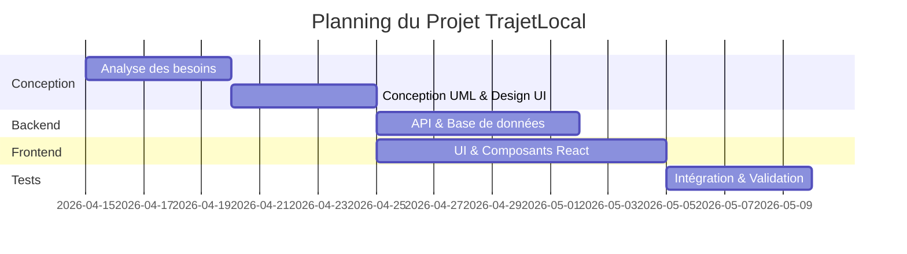
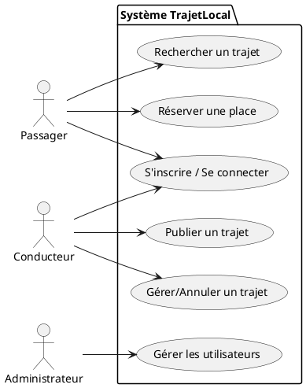
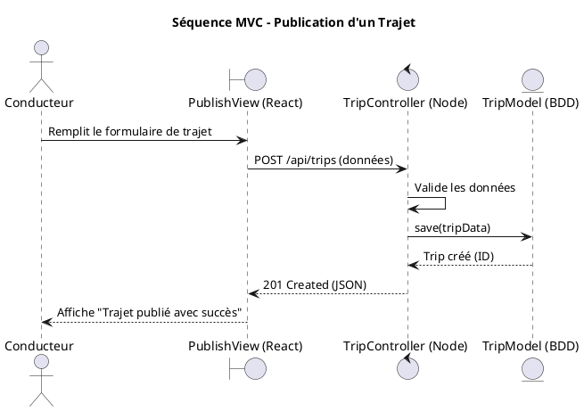

# Rapport de Projet : TrajetLocal

## 1. L'Idée du Projet
**TrajetLocal** est une plateforme de covoiturage de proximité conçue spécifiquement pour les trajets quotidiens urbains et interurbains (domicile-travail, université). L'objectif est de réduire l'empreinte carbone, de minimiser les coûts de transport pour les utilisateurs et de désengorger le trafic routier, en mettant en relation des conducteurs ayant des places libres avec des passagers cherchant un moyen de transport fiable et économique.

## 2. Définition des Acteurs
- **Passager** : Cherche, réserve et paie (ou participe aux frais) pour des trajets. Peut évaluer le conducteur.
- **Conducteur** : Propose des trajets, définit le prix, le nombre de places et accepte/refuse des réservations.
- **Administrateur** : Supervise la plateforme, gère les litiges, modère les utilisateurs et consulte les statistiques du système.

## 3. Besoins Fonctionnels et Non Fonctionnels

### Besoins Fonctionnels
- Inscription et authentification sécurisée (Conducteur/Passager).
- Publication de trajets (origine, destination, date, heure, prix, places).
- Recherche avancée de trajets avec filtres.
- Système de réservation (demande, acceptation/refus, annulation).
- Tableau de bord personnalisé pour le suivi des trajets.
- Système d'évaluation et de notation (Avis).

### Besoins Non Fonctionnels
- **Sécurité** : Hachage des mots de passe (Bcrypt), authentification par token (JWT).
- **Performance** : Temps de réponse de l'API < 500ms.
- **Disponibilité** : Architecture robuste permettant un fonctionnement 24/7.
- **Accessibilité & Ergonomie** : Interface intuitive, respect des normes WCAG (contraste, navigation clavier).

## 4. Méthodologie
Nous avons opté pour la **Méthodologie Agile (Scrum)** :
- **Sprints** de 1 à 2 semaines.
- **Daily meetings** pour le suivi de l'avancement.
- **Sprint Review** et **Retrospective** à la fin de chaque itération.
- Gestion du Backlog et des tâches via un tableau Kanban (Jira/Trello).

## 5. Technologies et Outils Utilisés
- **Frontend** : React.js, HTML5, CSS3 (Vanilla CSS & Flexbox/Grid).
- **Cartographie** : Leaflet.js pour l'affichage interactif des cartes.
- **Backend** : Node.js, Express.js.
- **Base de données** : MongoDB (NoSQL) ou MySQL (Relationnel).
- **Outils de conception** : Figma (UI/UX), PlantUML / Mermaid (UML).
- **Contrôle de version** : Git & GitHub.

## 6. Diagramme de Gantt

## 7. IHM / Accessibilité / Choix des couleurs
- **Couleurs** : Palette moderne basée sur le bleu (confiance, sécurité) et des accents verts (écologie). Utilisation d'un mode sombre (Dark Mode) pour le confort visuel.
- **Accessibilité** : 
  - Contraste élevé (Ratio minimum 4.5:1).
  - Labels pour tous les formulaires (Aria-labels).
  - Feedback visuel en temps réel (bordures rouges/vertes pour la validation des inputs).
- **Responsive** : Design "Mobile-first" adapté aux smartphones, tablettes et desktops.

## 8. Product Backlog (User Stories & Critères d'acceptation)

| ID | User Story | Critères d'acceptation (Tests à valider) |
|---|---|---|
| US1 | En tant qu'utilisateur, je veux m'inscrire pour accéder à la plateforme. | - Formulaire avec validation temps réel (regex). - Vérification de l'unicité de l'email. - Mot de passe haché en BDD. |
| US2 | En tant que conducteur, je veux publier un trajet. | - Remplissage obligatoire (départ, arrivée, date, places). - Le trajet apparaît immédiatement dans les résultats de recherche. |
| US3 | En tant que passager, je veux réserver une place. | - Le bouton "Réserver" change d'état (En attente). - Les places disponibles diminuent si accepté. |
| US4 | En tant que conducteur, je veux annuler un trajet. | - Confirmation demandée (pop-up). - Réservations liées annulées automatiquement et passagers notifiés. |

## 9. Outils IA utilisés et cas d'usage
- **Gemini / ChatGPT** : 
  - *Génération de code* : Création de composants React répétitifs (formulaires, tableaux).
  - *Débogage* : Analyse des stack traces (ex: erreurs asynchrones Node.js, erreurs de session).
  - *Conception* : Aide à la rédaction des scripts de base de données et des diagrammes PlantUML.
- **GitHub Copilot** : Autocomplétion contextuelle lors du développement dans VS Code.

## 10. Diagrammes UML

### 10.1. Diagramme de Cas d'Utilisation
**Initial** : Gestion basique (Inscription, Recherche, Publication).
**Modifié (Après itérations)** : Ajout de la gestion des annulations, des notifications, et du rôle Administrateur.

## 11. Itérations Effectuées

### Itération 1 : Fondation & Authentification
- **User Story** : US1 (Inscription/Connexion).
- **Estimation** : Théorique = 4 jours / Réalisée = 5 jours (retard dû à la validation Regex complexe).
- **Diagramme de Classes (Initial)** : Entité `User` seule.
- **Développement** : Création du Backend (JWT) et Frontend (Formulaires contrôlés React).
- **Tests (Sprint Review)** : Les utilisateurs voulaient un retour visuel direct lors de la frappe.
- **Corrections** : Implémentation de la validation "onBlur" et changement de couleur des bordures en temps réel.

### Itération 2 : Gestion des Trajets (Architecture MVC)
- **User Story** : US2 (Publication) et Recherche de trajets.
- **Estimation** : Théorique = 6 jours / Réalisée = 6 jours.
- **Diagramme de Séquence MVC (Publication de Trajet)** :

### Itération 3 : Réservations et Annulations
- **User Story** : US3 et US4.
- **Estimation** : Théorique = 5 jours / Réalisée = 6 jours (complexité de la gestion d'état cascade).
- **Tests (Sprint Review)** : La suppression d'un trajet laissait des réservations fantômes.
- **Corrections** : Ajout d'une logique transactionnelle côté Backend pour supprimer toutes les réservations associées lors de la suppression d'un trajet.

## 12. Rétrospective du Projet
- **Ce que nous avons appris** : L'importance d'une architecture claire dès le début. La gestion des états complexes en React nécessite des outils adaptés (Context API).
- **Points positifs** : Bonne communication en binôme, utilisation efficace de Git (Branches par features), interface utilisateur moderne et très appréciée.
- **Points à améliorer** : Mieux estimer le temps nécessaire pour l'intégration continue et la gestion des cas d'erreurs (Edge cases).

## 13. Rétrospective du Module
- **Ce que nous avons appris** : L'application concrète du cycle de vie du développement logiciel (Analyse -> UML -> Code -> Test).
- **Points positifs** : Les ateliers pratiques et l'approche par projet nous ont permis d'affronter des bugs réels de production.
- **Points à améliorer** : Passer plus de temps sur les tests automatisés (Unitaires/E2E).

## 14. Liens Utiles
- **GitHub du projet** : [https://github.com/Amenzouaghui/Trajet](https://github.com/Amenzouaghui/Trajet) (Exemple)
